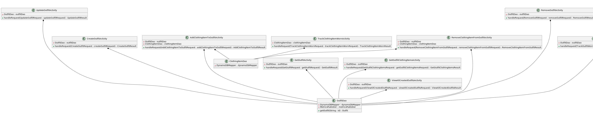
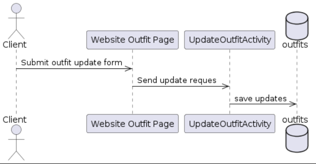
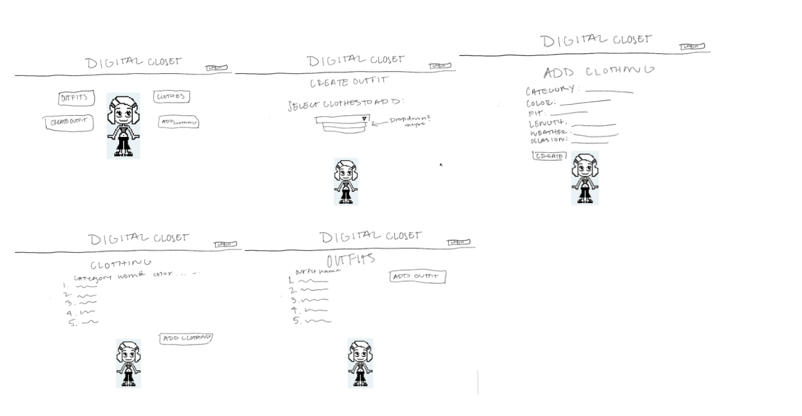

# Design Document

## Virtual Closet

## Problem Statement

In today's fast-paced world, individuals might find themselves overwhelmed by the sheer volume of clothing items they own. With fashion trends evolving rapidly and shopping becoming more accessible, closets tend to accumulate a diverse array of garments over time. However, this abundance can lead to challenges such as forgotten items and difficulty in styling.

This virtual closet seeks to address these challenges by offering a digital platform where users can catalog their clothing items, track usage of items, and effortlessly create stylish outfits. 

## Use Cases

U1. As a user, I want to create a new outfit with a given name and list of tags.
U2. As a user, I want to retrieve my outfit with a given ID.
U3. As a user, I want to update my outfit name.
U4. As a user, I want to add clothing items to my outfit.
U5. As a user, I want to retrieve all the clothing items in my outfit.
U6. As a user, I want to view all the outfits I’ve created
U7. As a user, I want to be able to remove clothing items from my outfit.
U8. As a user, I want to be able to remove an entire outfit.
U9. As a user, I want to be able to keep track of how many times I’ve worn an outfit
U10. As a user, I want to be able to keep track of how many times I’ve worn an article of clothing

## Stretch Goals

- Making the website more interactive with visuals - having pictures/ representation of the clothing

## UML Class Diagram 



# API

## Get Outfit Endpoint

- Accepts GET requests to /outfits/:id
- Authentication not needed
- Accepts an outfit ID and returns a corresponding outfit model
  - If the given outfit ID isn’t found, it will throw an OutfitNotFoundException

## Create Outfit Endpoint

- Accepts POST requests to /outfits
- Authentication needed
- Accepts data to create a new outfit with a provided name, a given customer ID, and an optional list of tags. Returns the new outfit, including a unique outfit ID
  - If the outfit contains any invalid characters, it will throw an InvalidAttributeValueException

## Update Outfit Endpoint

- Accepts PUT requests to /outfits/:id
- Authentication needed
- Accepts data to update an outfit including an outfit ID, an updated outfit name, and the customer ID associated with the outfit. Returns the updated outfit
  - If the outfit ID is not found, it will throw an OutfitNotFoundException
  - If the outfit name contains invalid characters, it will throw an InvalidAttributeValueException



## Add Clothing Item to Outfit Endpoint

- Accepts POST requests to /outfits/:id/clothing
- Authentication needed
- Accepts an outfit ID and a clothing item to be added. The clothing item is specified by the clothingID
  - If the outfit is not found, it will throw an OutfitNotFoundException
  - If the clothing item doesn’t exist yet, it will throw a ClothingItemNotFoundException

## Retrieve All Clothing Items in an Outfit Endpoint

- Accepts GET requests to /outfits/:id/clothing
- Authentication not needed
- Accepts outfit ID and returns a list of clothing items in the specified outfit
  - If the given outfit ID isn’t found, throws an OutfitNotFoundException

## View All Created Outfits Endpoint

- Accepts GET requests to /outfits/:customerId
- Authentication needed
- Accepts a customer ID and returns a list of OutfitModels created by that customer
  - If the given customer has not created any playlists, an empty list will be returned

## Remove Clothing Item from Outfit Endpoint

- Accepts DELETE requests to /outfits/:id/clothing/:clothingId
- Authentication needed
- Accepts an outfit ID and clothing ID of item to be removed
- Returns a message confirming the removal of the clothing item and an updated outfit
  - If the outfit ID isn’t found it throws an OutfitNotFoundException
  - If the clothing ID isn’t found it throws a ClothingItemNotFoundException

## Remove Outfit Endpoint

- Accepts DELETE requests to /outfits/:id
- Authentication needed
- Accepts outfit ID of outfit to be deleted
- Returns a message confirming the removal of the outfit and an updated outfit list
  - If the outfit ID isn’t found, it will throw an OutfitNotFoundException

## Track Times Worn an Outfit Endpoint

- Accepts GET requests to /outfits
- Accepts the customer ID
- Returns the sorted outfit list

## Track Times Worn of a Clothing Item Endpoint

- Accepts GET requests to /clothing
- Accepts the customer ID
- Returns the sorted clothing list

# Tables 

### 'outfits'
```
//outfits
id // partition key, string
name // string
customerId // string, Outfits-worncount-index partition key
tags // stringSet
clothingItemList // list
wornCount // number, outfits-worncount-index sort key
```

### 'clothing'
```
//clothing
clothingId // partition key, string
customerId // string, ClothingWornCountIndex partition key
wornCount // number, ClothingWornCountIndex sort key
category // string
color // string
fit // string
length // string
weather // string
occasion // string
```

# Mockup Pages




